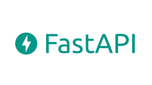
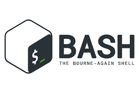

<h1>Hello World 🏾</h1>

<h1>Welcome To  Profile</h1>

###   **What's my current role in tech?** </h2>
       { softWare Engineer | Open Source Contributor } 

#### Connect with me 

#### About
Here are some basic things to know about DavidMark👽👳🏾‍♂️;

- 🔭 I’m currently working on acquiring DSA skills,
- 🌱 I’m currently exploring Backend Web Development,
- 👯 I’m looking for people to contribute to my projects.
- 🤔 I’m looking for help with expanding my community,
- 💬 Ask me about anything🌚,
- 📫 How to reach me: Email: nwaekwudavid@gmail.com, Phone: +2349136882184,
- 😄 Pronouns: He/Him/His,
- ⚡ Fun fact: I love Learning && teaching🎮.

#### My Core Languages
<code></code>
<code></code>
<code></code>
<code></code>

#### Frameworks/Libraries I Use
<code></code>
<code></code>  
<code></code>
<code></code>
<code></code>
<code></code>
<code></code>
<code></code>
<code></code>    
<code></code>

#### Tools I Use
<code></code>
<code></code>
<code></code>
<code></code>
<code></code>
<code></code>
             
             
       
#### Lifestyle

